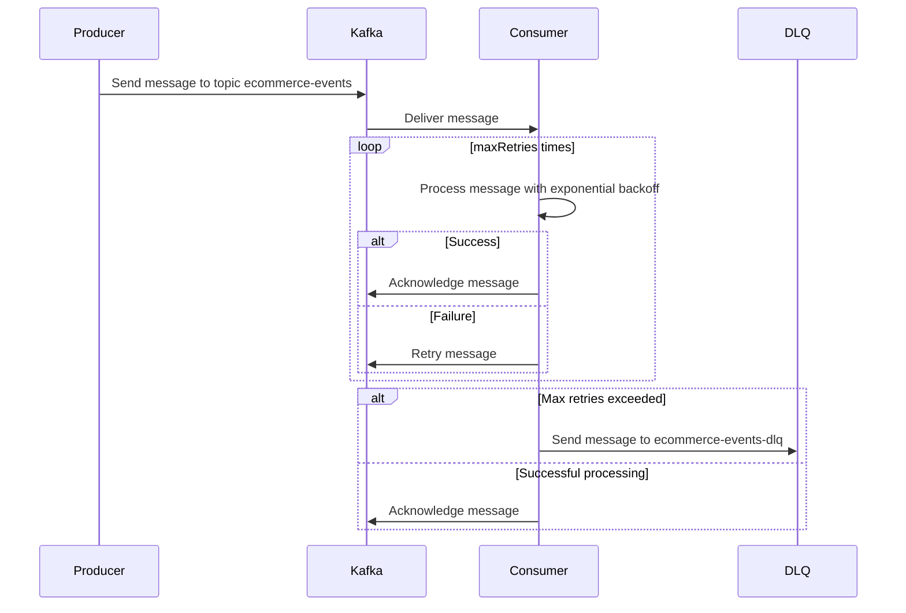

# Diagram

```mermaid
sequenceDiagram
    participant Producer
    participant Kafka
    participant Consumer
    participant DLQ

    Producer->>Kafka: Send message to topic ecommerce-events
    Kafka->>Consumer: Deliver message

    loop maxRetries times
        Consumer->>Consumer: Process message with exponential backoff
        alt Success
            Consumer->>Kafka: Acknowledge message
        else Failure
            Consumer->>Kafka: Retry message
        end
    end

    alt Max retries exceeded
        Consumer->>DLQ: Send message to ecommerce-events-dlq
    else Successful processing
        Consumer->>Kafka: Acknowledge message
    end

```